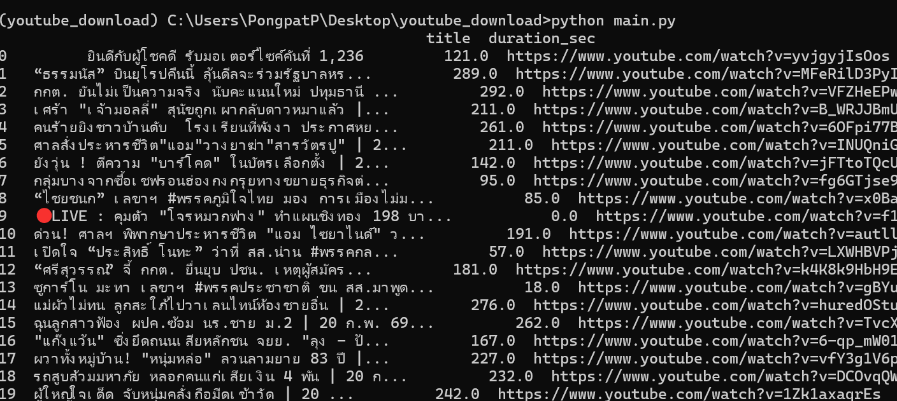
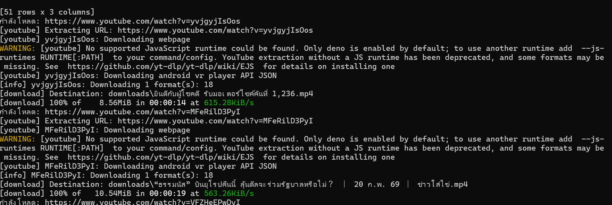

# Youtube download video 

## Getting Started

### 1. Environment Setup
Create a virtual environment and install the necessary dependencies:

```bash
$ conda create -n youtube_download python=3.11
$ conda activate youtube_download
$ cd {folder_path}
$ pip install -r requirements.txt
$ python main.py
```

## Results



